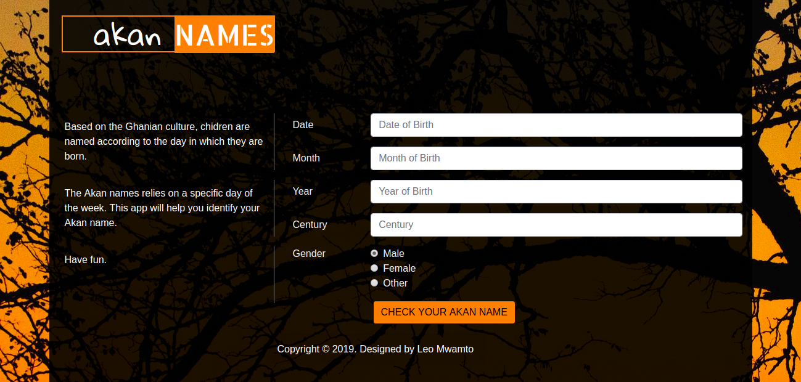

# Web App for Calculating Ghanian Akan Names

## Author 
   Leonidah Mwamto

## Description
    + This is a Web Application that makes use of the javaScript language to calculate the day of week in which one is born..
    + The users are required to enter their birth details which include the date, month, year and century in order to find out the exact day of the week in which they were born, hence identify their Ghanian Akan names.
    + Finally, with the correct information provided, the App should be in a position to display the day of the week in which the user was born and their Akan names.

## Screenshot 
   

## Technologies Used
    i. Bootstrap
    ii. HTML
    iii. javaScript
    iv. CSS

## List of Contributors
    Leonidah Mwamto

## BDD
    + This web application requires the user to input their birth details.
    + Insert the information in the different text arears.
    + Click the "check your akan name" button to submit the information provided.
    + The app should indicate the day of week which you were born and your Ghanian Akan name.

## Known Bugs
    The application does not put into consideration the month of February that has less days. Instead it assumes all months of the year are equivalent to thirty days. As a result it ignores leap years and does not provide the exact day of week for some users.

## Installations
    To have this web app in your files, clone it from my github directory named IP-Akan-Names. Unzip the files within a folder suitable to you and use it as pleased.

## Licence
    MIT
    (https://choosealicense.com/licenses/mit/)
